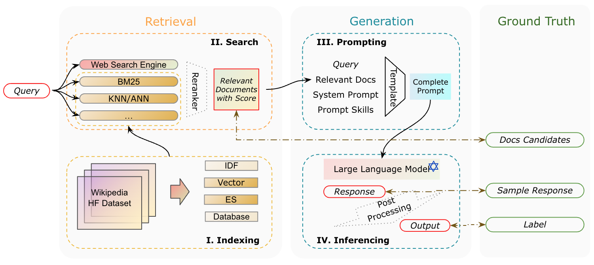
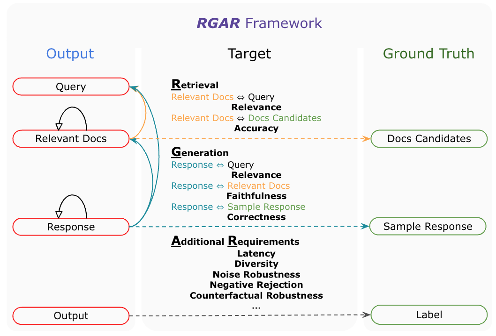
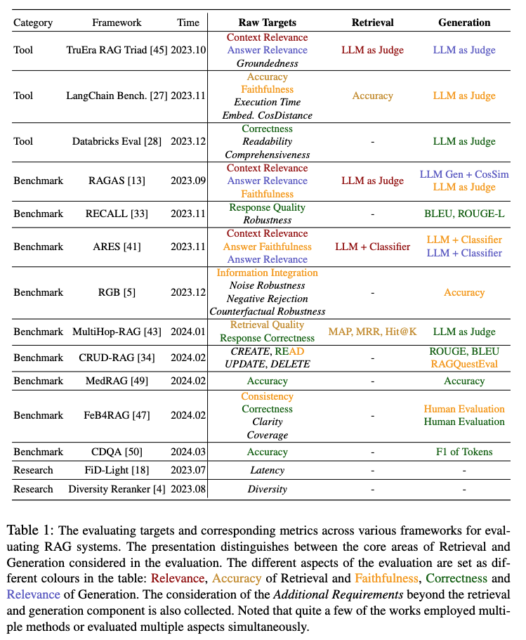

# Awesome RAG Evaluation

The official repository for the paper: *Evaluation of Retrieval-Augmented Generation: A Survey* [Coming Soon].

### Abstract

Retrieval-Augmented Generation (RAG) has emerged as a pivotal innovation in natural language processing, enhancing generative models by incorporating external information retrieval. Evaluating RAG systems, however, poses distinct challenges due to their hybrid structure and reliance on dynamic knowledge sources. We consequently enhanced an extensive survey and proposed an analysis framework for benchmarks of RAG systems, **RGAR** (**R**etrieval, **G**eneration, **A**dditional **R**equirement), designed to systematically analyze RAG benchmarks by focusing on measurable outputs and established truths. Specifically, we scrutinize and contrast multiple quantifiable metrics of the Retrieval and Generation component, such as relevance, accuracy, and faithfulness, of the internal links within the current RAG evaluation methods, covering all the possible output and ground truth pairs. We also analyze the integration of additional requirements of different works. Additionally, we discuss the limitations of current benchmarks and propose potential directions for further research to address these shortcomings and advance the field of RAG evaluation. In conclusion, this paper collates the challenges associated with RAG evaluation. It presents a thorough analysis and examination of existing methodologies for RAG benchmark design based on the proposed RGAR framework.

### Analysis Framework for Evaluating RAG Systems

<!-- <p align="center">
    
</p>

* Figure 1. The structure of the RAG system with retrieval and generation components and corresponding four phrases: indexing, search, prompting, and inferencing. The pairs of EOs and GTs are highlighted in red and green, with brown dashed arrows. -->

<p align="center">
    
</p>

* The **Target** modular of ***RGAR*** framework. The retrieval and generation components are highlighted in red and green, respectively. The internal links between the retrieval and generation components are highlighted in blue. The external links between the retrieval and generation components and the additional requirements are highlighted in brown. The pairs of EOs and GTs are highlighted in red and green, respectively. The brown dashed arrows indicate the relationships between the EOs and GTs.


### Reference Framework
<p align="center">
    
</p>

| Category | Framework | Webpage | Paper |
|---|---|---|---|
| Tool | TruEra RAG Triad | https://www.trulens.org/trulens_eval/getting_started/core_concepts/rag_triad/ | - |
| Tool | LangChain Bench. | https://langchain-ai.github.io/langchain-benchmarks/notebooks/retrieval/langchain_docs_qa.html | - |
| Tool | Databricks Eval | https://www.databricks.com/blog/LLM-auto-eval-best-practices-RAG | - |
| Benchmark | RAGAs | https://github.com/explodinggradients/ragas | https://aclanthology.org/2024.eacl-demo.16/ |
| Benchmark | RECALL | - | https://arxiv.org/abs/2311.08147 |
| Benchmark | ARES | https://github.com/stanford-futuredata/ARES | https://arxiv.org/abs/2311.09476 |
| Benchmark | RGB | https://github.com/chen700564/RGB | https://ojs.aaai.org/index.php/AAAI/article/view/29728 |
| Benchmark | MultiHop-RAG | https://github.com/yixuantt/MultiHop-RAG/ | https://arxiv.org/abs/2401.15391 |
| Benchmark | CRUD-RAG | https://github.com/IAAR-Shanghai/CRUD_RAG | https://arxiv.org/abs/2401.17043v2 |
| Benchmark | MedRag | https://github.com/Teddy-XiongGZ/MedRAG | http://arxiv.org/abs/2402.13178v2 |
| Benchmark | FeB4RAG | https://github.com/ielab/FeB4RAG | http://arxiv.org/abs/2402.11891v1 |
| Benchmark | CDQA | https://github.com/Alibaba-NLP/CDQA | https://arxiv.org/abs/2402.19248v2 |
| Research | FiD-Light | - | https://doi.org/10.1145/3539618.3591687 |
| Research | Diversity Reranker | https://towardsdatascience.com/enhancing-rag-pipelines-in-haystack-45f14e2bc9f5 | - |

<!-- ### LLMs Learderboard
[LMSYS Chatbot Arena Leaderboard](https://huggingface.co/spaces/lmsys/chatbot-arena-leaderboard): https://arxiv.org/abs/2306.05685v4
[AlpacaEval Leaderboard](https://tatsu-lab.github.io/alpaca_eval/): https://arxiv.org/abs/2305.14387
[SuperCLUE](https://superclueai.com/): https://arxiv.org/abs/2307.15020 -->

<!-- ### Citation

If you find this repository helpful, please consider citing our paper:

```
@article{rag-evaluation,
  title={Evaluation of Retrieval-Augmented Generation: A Survey},
  author={Hao Yu, },
  journal={},
  year={2024}
}
``` -->
