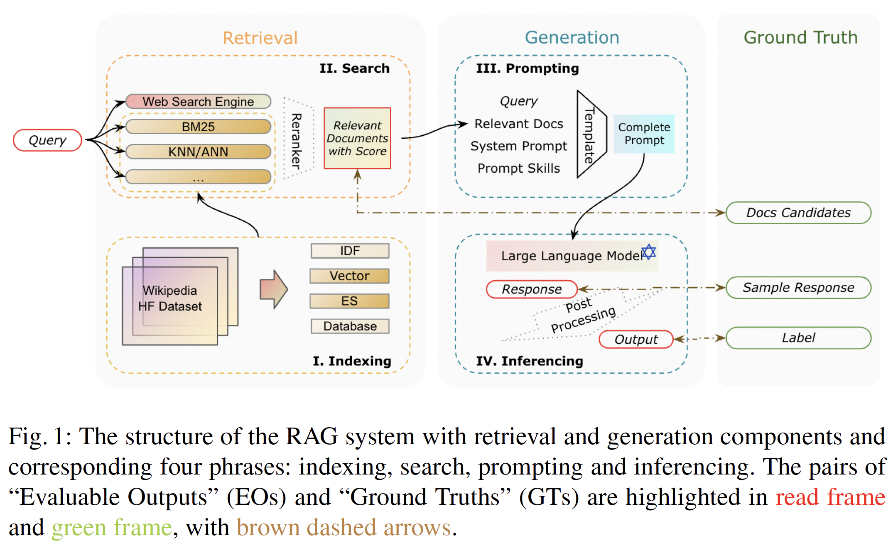
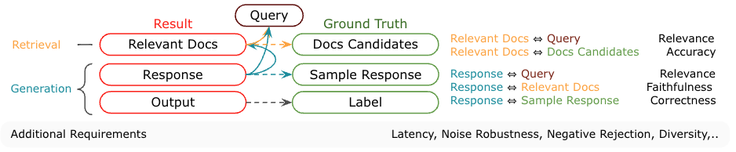
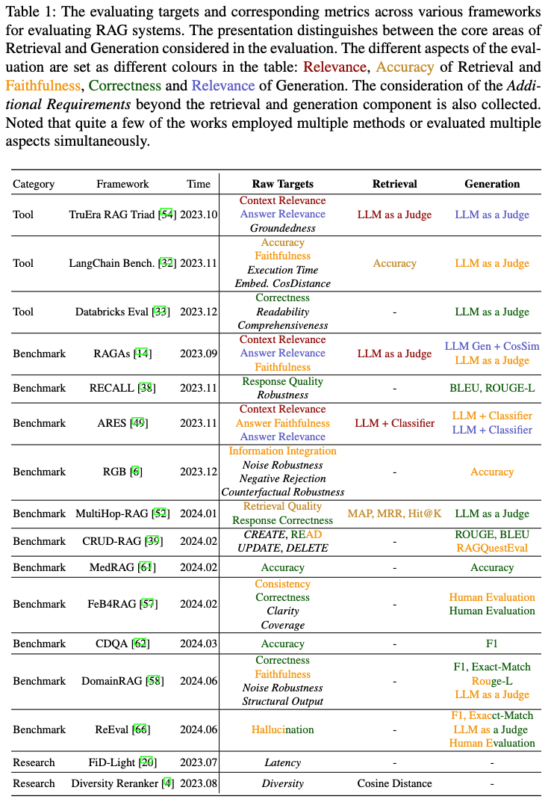

# Awesome RAG Evaluation

<p align="center"> English | <a href="README_cn.md"> 简体中文 </a></p>

The official repository for the paper: *Evaluation of Retrieval-Augmented Generation: A Survey* [Arxiv](https://arxiv.org/pdf/2405.07437). This paper has been accepted by the [2024 CCF Big Data](https://ccf.org.cn/BigData2024).

### Abstract

Retrieval-Augmented Generation (RAG) has recently gained traction in natural language processing. Numerous studies and real-world applications are leveraging its ability to enhance generative models through external information retrieval. Evaluating these RAG systems, however, poses unique challenges due to their hybrid structure and reliance on dynamic knowledge sources. To better understand these challenges, we conduct **A** **U**nified **E**valuation **P**rocess **o**f **RA**G (*Auepora*) and aim to provide a comprehensive overview of the evaluation and benchmarks of RAG systems. Specifically, we examine and compare several quantifiable metrics of the Retrieval and Generation components, such as relevance, accuracy, and faithfulness, within the current RAG benchmarks, encompassing the possible output and ground truth pairs. We then analyze the various datasets and metrics, discuss the limitations of current benchmarks, and suggest potential directions to advance the field of RAG benchmarks.


### Analysis Framework for Evaluating RAG Systems

<!-- <p align="center">
    
</p>

* Figure 1. The structure of the RAG system with retrieval and generation components and corresponding four phrases: indexing, search, prompting, and inferencing. The pairs of EOs and GTs are highlighted in red and green, with brown dashed arrows. -->

<p align="center">
    
</p>

* The **Target** modular of *Auepora*. The retrieval and generation components are highlighted in red and green, respectively.

### Reference Framework
<p align="center">
    
</p>

| Category | Framework | Webpage | Paper |
|---|---|---|---|
| Tool | TruEra RAG Triad | https://www.trulens.org/trulens_eval/getting_started/core_concepts/rag_triad | - |
| Tool | LangChain Bench. | https://langchain-ai.github.io/langchain-benchmarks/notebooks/retrieval/langchain_docs_qa.html | - |
| Tool | Databricks Eval | https://www.databricks.com/blog/LLM-auto-eval-best-practices-RAG | - |
| Tool | RAG Playground | - | https://arxiv.org/abs/2412.12322 |
| Tool | ai-evaluation | https://github.com/future-agi/ai-evaluation | - |
| Benchmark | RAGAs | https://github.com/explodinggradients/ragas | https://aclanthology.org/2024.eacl-demo.16 |
| Benchmark | RECALL | - | https://arxiv.org/abs/2311.08147 |
| Benchmark | ARES | https://github.com/stanford-futuredata/ARES | https://aclanthology.org/2024.naacl-long.20 |
| Benchmark | RGB | https://github.com/chen700564/RGB | https://dl.acm.org/doi/10.1609/aaai.v38i16.29728 |
| Benchmark | MultiHop-RAG | https://github.com/yixuantt/MultiHop-RAG | https://openreview.net/forum?id=t4eB3zYWBK#discussion |
| Benchmark | CRUD-RAG | https://github.com/IAAR-Shanghai/CRUD_RAG | https://dl.acm.org/doi/10.1145/3701228 |
| Benchmark | MedRAGBench | https://github.com/Teddy-XiongGZ/MedRAG | https://aclanthology.org/2024.findings-acl.372 |
| Benchmark | FeB4RAG | https://github.com/ielab/FeB4RAG | https://dl.acm.org/doi/10.1145/3626772.3657853 |
| Benchmark | CDQA | https://github.com/Alibaba-NLP/CDQA | https://aclanthology.org/2025.coling-main.695 |
| Benchmark | DomainRAG | https://github.com/ShootingWong/DomainRAG | https://arxiv.org/abs/2406.05654v2 |
| Benchmark | ReEval | https://autodebug-llm.github.io | https://aclanthology.org/2024.findings-naacl.85 |
| Benchmark | RAGBench | https://huggingface.co/datasets/rungalileo/ragbench | https://arxiv.org/abs/2407.11005 |
| Benchmark | OmniEval | https://github.com/RUC-NLPIR/OmniEval | https://arxiv.org/abs/2412.13018 |
| Benchmark | MTRAG | https://github.com/ibm/mt-rag-benchmark | https://arxiv.org/abs/2501.03468 |
| Benchmark | LegalBench-RAG | https://github.com/zeroentropy-ai/legalbenchrag | https://arxiv.org/abs/2408.10343 |
| Benchmark | eRAG | https://github.com/alirezasalemi7/eRAG | https://dl.acm.org/doi/10.1145/3626772.3657957 |
| Benchmark | CoFE-RAG | - | https://arxiv.org/abs/2410.12248 |
| Benchmark | U-NIAH | https://github.com/Tongji-KGLLM/U-NIAH | https://arxiv.org/abs/2503.00353 |
| Benchmark | CoURAGE | - | https://link.springer.com/chapter/10.1007/978-3-031-70242-6_37 |
| Benchmark | RAGEval | https://github.com/OpenBMB/RAGEval | https://arxiv.org/abs/2408.01262 |
| Benchmark | OCRRAG | https://github.com/opendatalab/OHR-Bench | https://arxiv.org/abs/2412.02592 |
| Benchmark | ArabicRAGEval | - | https://arxiv.org/abs/2403.18350 |
| Benchmark | FairnessRAG | - | https://aclanthology.org/2025.coling-main.669 |
| Benchmark | TelecomRAGEval | - | https://arxiv.org/abs/2407.12873 |
| Benchmark | CRAG | https://github.com/facebookresearch/CRAG | https://proceedings.neurips.cc/paper_files/paper/2024/hash/1435d2d0fca85a84d83ddcb754f58c29-Abstract-Datasets_and_Benchmarks_Track.html |
| Benchmark | FreshLLMs | https://github.com/freshllms/freshqa | https://aclanthology.org/2024.findings-acl.813 |
| Benchmark | InstructRAG | https://followrag.github.io | https://arxiv.org/abs/2410.09584 |
| Benchmark | SCARF | https://github.com/Eustema-S-p-A/SCARF | https://arxiv.org/pdf/2504.07803 |
<!-- | Research | FiD-Light | - | https://doi.org/10.1145/3539618.3591687 | -->
<!-- | Research | Diversity Reranker | https://towardsdatascience.com/enhancing-rag-pipelines-in-haystack-45f14e2bc9f5 | - | -->
<!-- | Benchmark | NoMIRACL | https://github.com/project-miracl/nomiracl  | https://arxiv.org/abs/2312.11361 | -->
<!-- | Benchmark | FaaF | https://github.com/vasiliskatr/faaf | https://arxiv.org/pdf/2403.03888 -->
<!-- ### LLMs Learderboard
[LMSYS Chatbot Arena Leaderboard](https://huggingface.co/spaces/lmsys/chatbot-arena-leaderboard): https://arxiv.org/abs/2306.05685v4
[AlpacaEval Leaderboard](https://tatsu-lab.github.io/alpaca_eval/): https://arxiv.org/abs/2305.14387
[SuperCLUE](https://superclueai.com/): https://arxiv.org/abs/2307.15020 -->

### Citation

If you find this paper or repository helpful, please consider citing our work:

```
@InProceedings{Yu2025,
    author    = {Yu, Hao and Gan, Aoran and Zhang, Kai and Tong, Shiwei and Liu, Qi and Liu, Zhaofeng},
    booktitle = {Big Data},
    title     = {Evaluation of Retrieval-Augmented Generation: A Survey},
    year      = {2025},
    address   = {Singapore},
    editor    = {Zhu, Wenwu and Xiong, Hui and Cheng, Xiuzhen and Cui, Lizhen and Dou, Zhicheng and Dong, Junyu and Pang, Shanchen and Wang, Li and Kong, Lanju and Chen, Zhenxiang},
    pages     = {102--120},
    publisher = {Springer Nature Singapore},
    isbn      = {978-981-96-1024-2},
}
@misc{gan2025retrievalaugmentedgenerationevaluation,
    title={Retrieval Augmented Generation Evaluation in the Era of Large Language Models: A Comprehensive Survey}, 
    author={Aoran Gan and Hao Yu and Kai Zhang and Qi Liu and Wenyu Yan and Zhenya Huang and Shiwei Tong and Guoping Hu},
    year={2025},
    eprint={2504.14891},
    archivePrefix={arXiv},
    primaryClass={cs.CL},
    url={https://arxiv.org/abs/2504.14891}, 
}
```

Citation for benchmarks: [benchmarks.bib](benchmarks.bib)

### Call for Contributions

We welcome contributions to this repository, including new benchmarks, datasets, and evaluation metrics. If you have any suggestions or would like to collaborate, please open an issue or pull request.

### Changelog

- 2024-05-11: Initial release of the paper and repository.
- 2024-06-25: Acceptance of the paper by the 2024 CCF Big Data.
- 2024-06-30: Add two benchmarks: DomainRAG and ReEval.
- 2024-07-03: Update Arxiv version to v2.
- 2024-07-16: Add multiple new benchmarks and research papers to the reference table. Update existing paper links.
- 2025-04-21: Add new benchmarks for RAG system.
