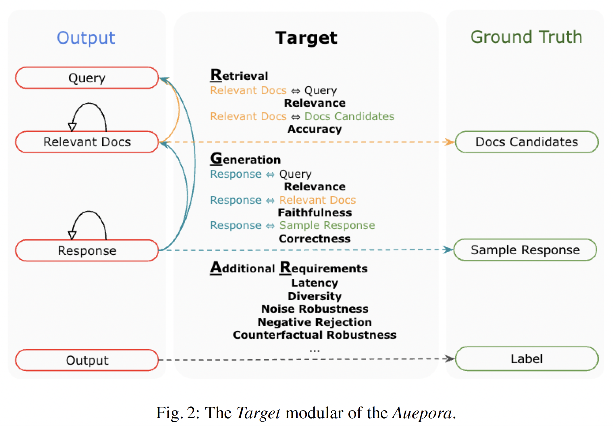
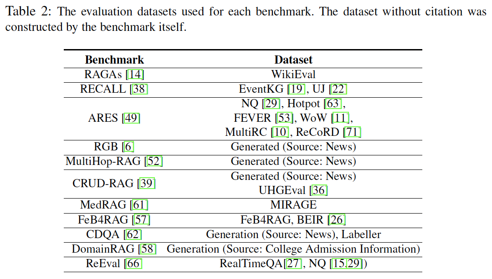
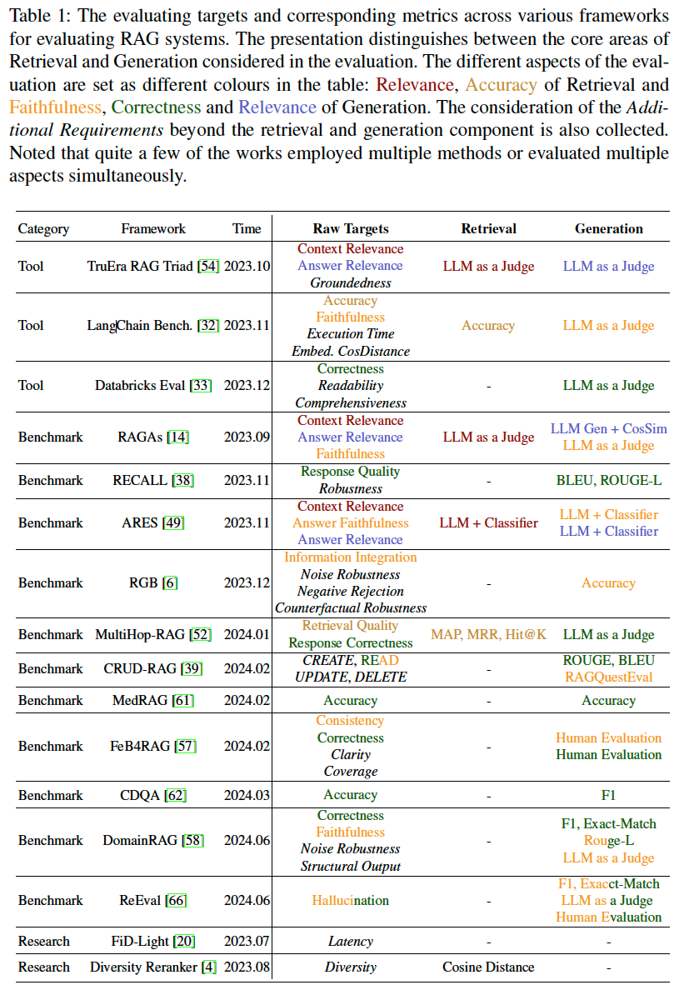

# Evaluation of Retrieval-Augmented Generation: A Survey

<p align="center"> <a href="README.md"> English </a>| 简体中文 </p>

本文地址：[Arxiv](https://arxiv.org/pdf/2405.07437)

本文已被[2024年CCF大数据](https://ccf.org.cn/BigData2024)接收。

相关工作的文章和代码汇总在：[Awesome RAG Evaluation](https://github.com/YHPeter/Awesome-RAG-Evaluation) 

## 摘要
RAG（Retrieval-Augmented Generation，检索增强生成）由于其复杂的结构性和对检索知识库的依赖，使得RAG系统的评估仍存在不少的挑战。为了更好地理解这些挑战和标准化RAG评估体系，我们提出了A RAG Unified Evaluation Process of RAG （Auepora）。我们对可能的输入和输出进行了整理，总结了现有RAG评估基准中的评估目标，如相关性（Relevance）、准确性（Correctness）和忠实度（Faithfulness）。同时分析了各种数据集和量化指标。最后基于当前基准测试的局限性，指出了RAG基准测试领域发展的潜在方向，为接下来的RAG评测标准提供参考。

## 引言
RAG通过整合检索到的信息提升了生成大语言模型（Large Language Model，LLM）的能力，并缓解了大语言模型面临“幻觉”和输出事实错误的回答，从而提升了内容的可靠性和丰富性。其中RAG主要由检索和生成两阶段组成。检索涉及两个部分，建立文档索引和执行文档检索，通常还会结合精拍/重排来进一步微调检索到的文档排序。准确率、召回率和F1分数是主要评价指标，但这些传统的评价指标无法反映检索结果的有效性和多样性，无法有效适配后续生成阶段所需的准确性和全面性的需求。复杂的信息来源和多样的检索策略也是另一大挑战。在生成阶段中，提示词撰写阶段，引入例如思维链（Chain of Thought，CoT）、思维树和改述响应（Rephrase and Respond，RaR）的方法，可以让模型生成质量更高的回答。最后大语言模型结合用户问题、检索到的文档和改进的提示词生成最终的响应。但如何确保生成内容的真实性、全面性、准确性和生成模型的抗干扰性仍是需要考虑的难点。特别是涉及一些创造性任务和逻辑推理任务，常用生成指标，BLEU、ROUGE和F1分数任然无法完全替代真人进行全面评估，不仅如此，还需要考虑检索和生成组件的相互关联，例如生成阶段检索信息的利用率，响应延迟、抗误导能力和和多场景下的鲁棒性，以及面对复杂的多文档信息的处理能力。

## *Auepora*（**A** **U**nified **E**valuation **P**rocess **o**f **RA**G）

为了应对这些挑战，系统性的比较RAG系统的检索和生成质量，本文提出**A** **U**nified **E**valuation **P**rocess **o**f **RA**G（*Auepora*）来应对上述挑战并整理最近的RAG评估框架。*Auepora*考虑三个方向：评估目标（Target）、评估数据集（Dataset）和量化指标（Metric），分别回答了RAG系统评估的三个关键问题：评价什么？如何评价？如何衡量？基于*Auepora*，本文（1）关注评估目标、数据集和量化指标，为RAG系统评估提供了一个更高的视角。（2）全面分析了现有的RAG基准测试，总结了它们的优势和局限性，并为RAG系统评估的未来发展提出了建议。


### 评估目标（What to Evaluate?）
<p align="center">
    
    </br>
</p>

在目标阶段，我们根据RAG运行中存在的“可评估结果”（EOs）和对应的“标准结果”（GTs），尽可能完整覆盖相应的评估目标（如上图）。

**检索**：主要涵盖【相关文档（Relevant Docs）与查询（Query）】之间的关系，以及【相关文档（Relevant Docs）与文档候选集（Docs Candidates）】之间的关系，前者确保检索到的文档与查询主题相关，后者确保检索到的文档在文档候选集中的排名合理。
<!-- 前者衡量检索到的文档与查询需求的匹配程度，后者评估检索到的文档在候选集中的准确性。 -->
**生成**：包括【生成的输出（Response）与问题（Query）】之间的一致性、【生成的输出（Response）与相关文档（Relevant Docs）】之间的忠实度，以及【生成的输出（Reponse）与预期输出（Sample Response）】之间的准确性。这些度量指标可以帮助评估生成的内容是否与查询相关、是否忠实于检索到的文档以及是否准确回答了问题。

此外，还有应考虑一些**额外需求**，如延迟、多样性、噪声稳健性、负拒绝和对抗性稳健性，用于确保RAG系统在实际场景中与人类偏好一致的实际适用性。这些额外需求的指标可以帮助评估RAG系统在实际应用中的表现。

### 评估数据（How to Evaluate?）

<p align="center">
    
    </br>
</p>
<!--  -->

在表2中的评估框架主要采取两种策略来构建评测数据集，一种利用现有数据集，剩下的则会为特定评估目标生成新的数据集。其中几个评测框架借鉴了KILT（Knowledge Intensive Language Tasks）基准测试的一部分，如NQ、HotpotQA和FEVER，以及其他成熟的数据集，如SuperGLUE（MultiRC和ReCoRD）。但是这些数据集无法解决实时变化、更真实的场景中的挑战。类似的情况由RAGAs提及并试图通过构建更新的WikiEval来解决，WikiEval基于2022年左右之前的维基百科数据集，以此来评估RAG系统在更新的数据集中的鲁棒性。

同时大语言模型的出现彻底颠覆了数据集构建过程。现在研究人员可以根据特定的评估目标来设计数据：让较强的大语言模型根据它的理解生成”问题和答案“对用于下一步的评估，轻松创建大规模所需的数据集。RGB、MultiHop-RAG、CRUD-RAG和CDQA都采用了这种方法，他们均基于大语言模型和实时新闻构建相应的测试数据集。除新闻外，DomainRAG从每年变化的大学网站招生信息中收集数据，同时设置了各种类型的QA数据集，包括单文档、多文档、单轮和多轮对话，以此来检验RAG系统的鲁棒性。

#### 量化指标（How to Measure?）

<p align="center">
    
    </br>
</p>
<!--  -->

通过量化指标和对应测试数据来精准量化评估目标是RAG评估的最后一步。然而符合人类偏好的量化指标并不容易，只能通过多方面来尽可能覆盖所有场景，也导致了量化指标的繁杂。

##### 检索指标

在检索评估中，关键在于选用能准确反映相关性、准确性和多样性的指标。这些指标不仅体现系统在获取相关信息方面的精确度，还需展示其在动态知识源中的鲁棒性。

##### 生成指标
传统指标如BLEU、ROUGE和F1仍然具有关键作用，强调精确度和召回率在输出质量方面的重要性。在文本质量方面，需关注连贯性、相关性、流畅性和与人类判断的一致性。这就需要能够评估语言生成的细微差别的指标，如事实正确性、可读性和用户对生成内容的满意度。然而，随着误报率、错误再现率和错误检测率等指标的出现，评估变得更加全面，能更好地反映生成内容的质量。

##### 额外需求
诸如延迟、多样性、噪声稳健性、负拒绝和对抗性稳健性等指标，用于确保RAG系统在实际场景中与人类偏好相符的实际适用性。深入探讨了用于评估这些额外需求的指标，以及如何将它们与传统指标相结合，以更全面评估RAG系统的性能。


### 讨论和展望

对于当下大语言模型和RAG结合的系统而言，传统的问答数据集和指标仍然是最常用的评估资源和方式。然而大语言模型在传统问答数据集上展现出的强大能力，已经无法满足我们对RAG系统评测的需求。为了全面评估整个RAG系统的性能，需要有多样化和特定于RAG的基准测试。构建一个通用的评估框架，如*Auepora*，以便更好地理解评估RAG系统的评估目标，逐渐深入评估所需的数据资源和量化指标，以便更好地理解和评估RAG系统。

传统数据集的创建是复杂且费时费力，并有一定的局限性，无法覆盖不同的且快速迭代的评测目标。对于更精细的评测而言，定制数据集已经是一个必选项。此外，数据集的多样性，从每年招生信息到实时新闻文章，都是评测的重要组成部分。但构建这些数据集的构建需要持续的投入人力和物力，难以实现自动化的评估。解法任然是大语言模型的强大能力，大语言模型可以在处理繁杂数据和自动生成问答对的，持续的实现日常或更细粒度的时间的数据集构建，以评估RAG系统在实时变化数据中的鲁棒性和性能。

在量化指标方面，使用大语言模型对回答打分已经形成一种趋势。和传统指标相比，大语言模型可以更好地反映人类对生成内容的评价；和人类打分相比，它在定制化和自动化方面更具优势。然而，使用大语言模型对输出打分也存在挑战。不同人和大模型都会对正确性、清晰度和丰富性有不同的理解，不同的提示词的评分效果可能会有所不同，如何建立一个统一的评分体系和提示词编写，在对齐人类判断、和公平的评分标准达成平衡。

除上述挑战外，还需要考虑使用大语言模型进行数据生成和验证的大量资源消耗。RAG基准测试也必须在全面评估和有限资源之间取得平衡。因此，如何实现在尽可能少的数据和计算资源下实现最佳评估效果，是未来研究的一个重要方向。


## 总结
本文探索了评估RAG系统的复杂性和挑战，并提出了一种分析RAG全流程的评估的方法（*Auepora*），重点关注评估目标、评估数据和量化指标。希望为研究人员提供一个视角更好地理解和RAG评价系统以及推动搭建更完善的RAG基准测试。

```
@misc{yu2024evaluation,
      title={Evaluation of Retrieval-Augmented Generation: A Survey}, 
      author={Hao Yu and Aoran Gan and Kai Zhang and Shiwei Tong and Qi Liu and Zhaofeng Liu},
      year={2024},
      eprint={2405.07437},
      archivePrefix={arXiv},
      primaryClass={cs.CL}
}
```